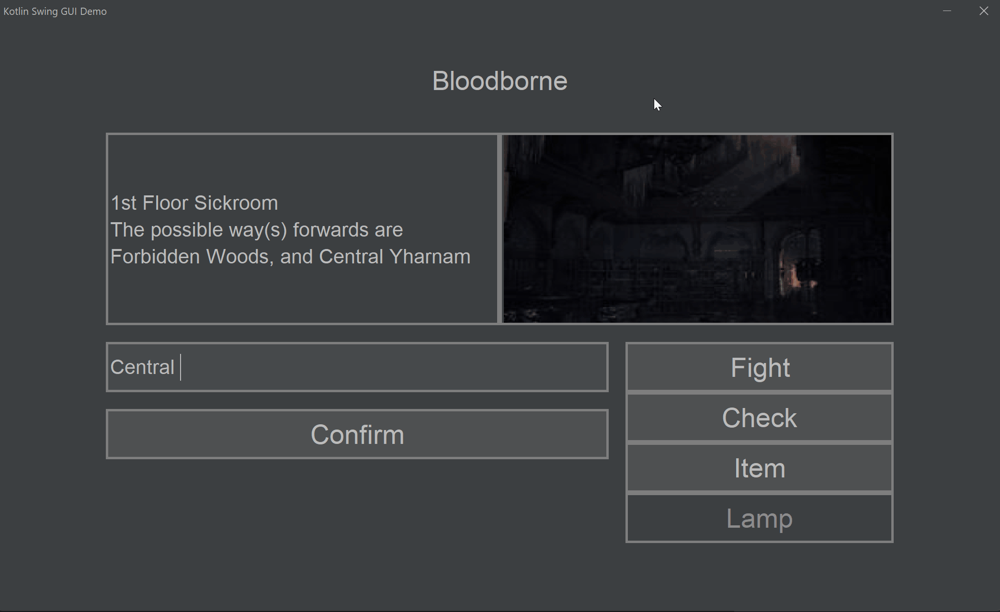
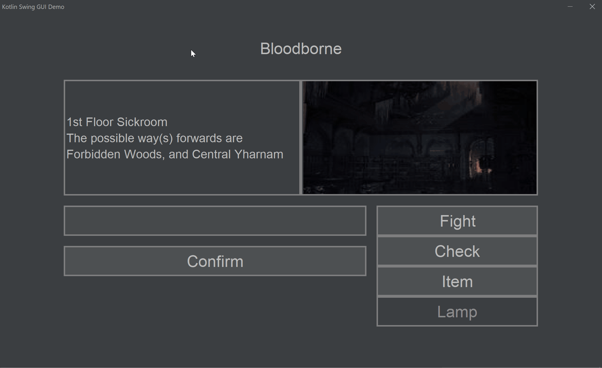
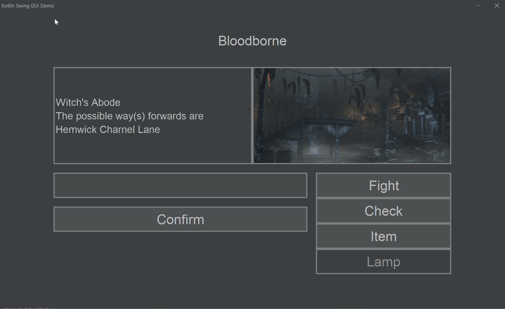
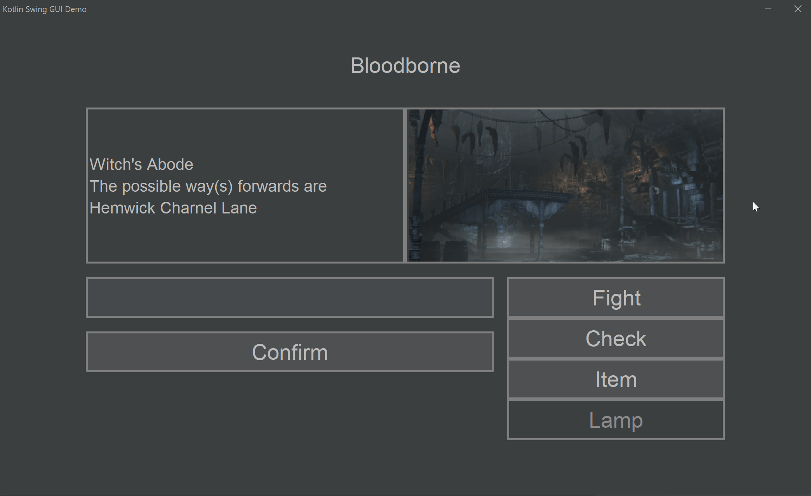
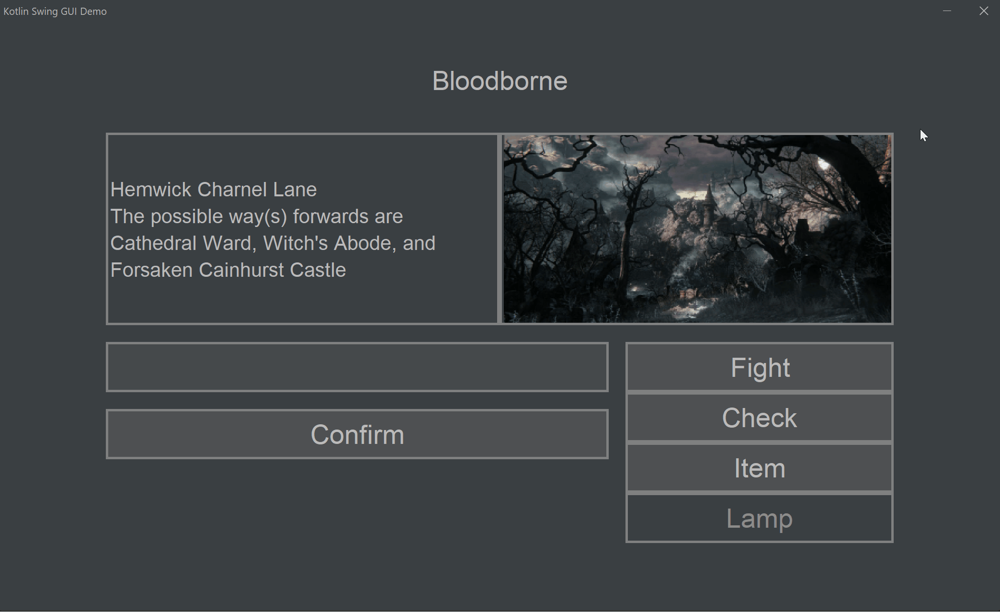
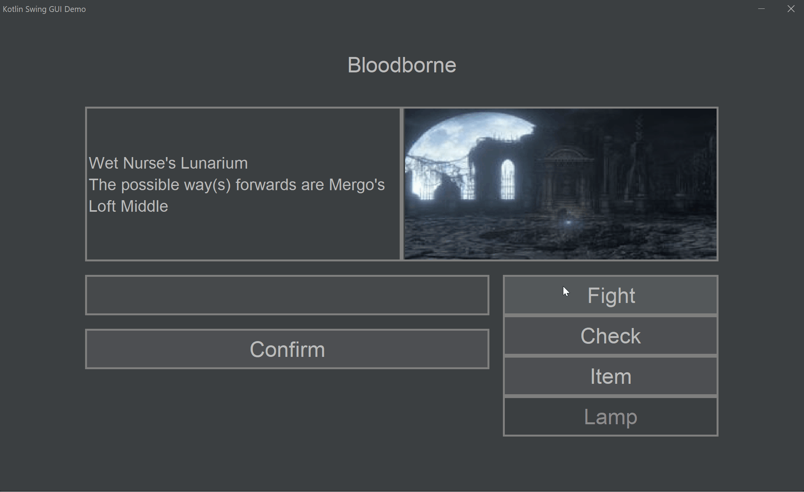
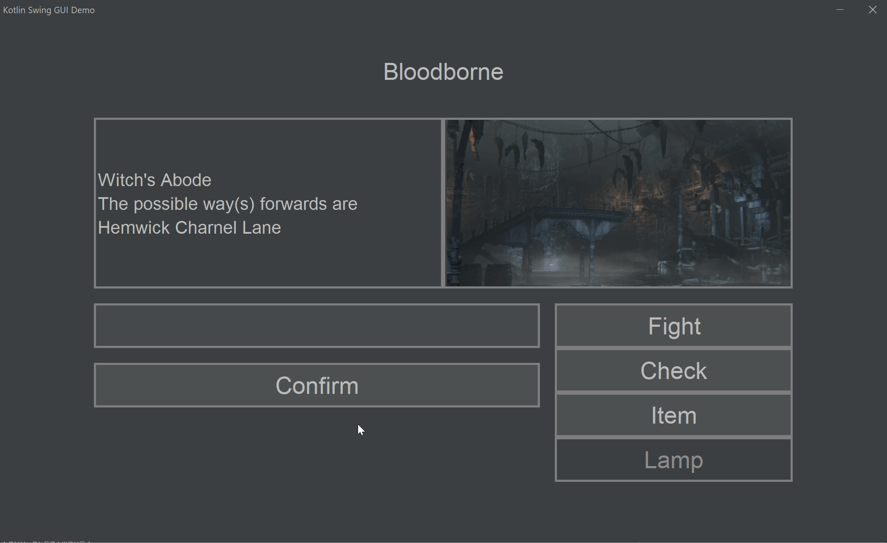
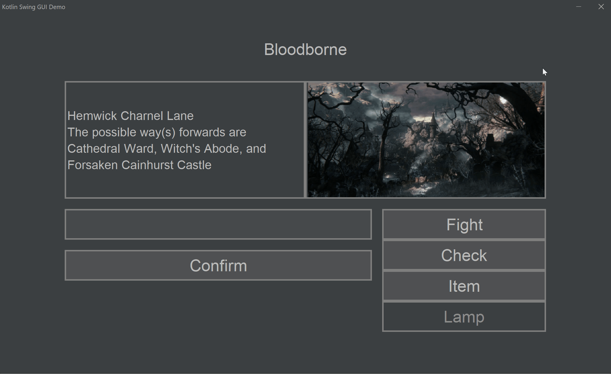
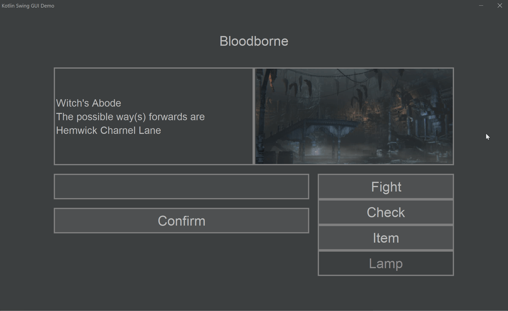
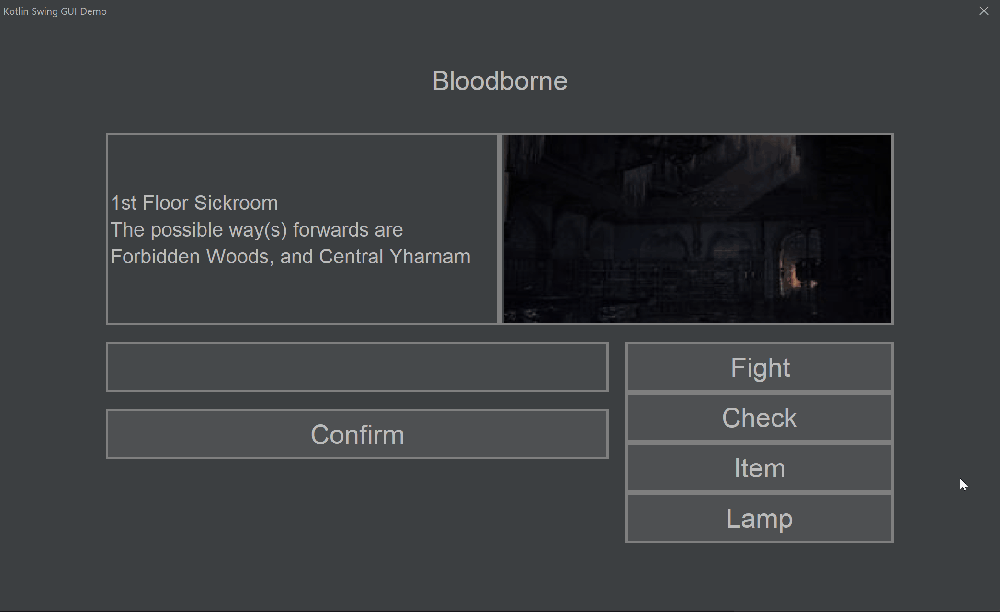

# Results of Testing

The test results show the actual outcome of the testing, following the [Test Plan](test-plan.md)

---

## Feature test 1

This will be a test of the player movement system.

### Test Data To Use

The data used in this test will be the current location the player is at, combined with the connections of that location.

### Test Result

Here, the player aims to move to a connection of their current location, and succeed in doing so.

Here, the player aims to move to somewhere that isn't a connection of their current location, and therefore do not move from their current location.

---

## Feature test 2

This will be a test of the fight button.

### Test Data To Use

The data used in this test will be the current location the player is at, and the current state of an item (Whether it is acquired or not)

### Test Result

Here, the player attempts to fight while in the vicinity of an umbilical cord, and successfully manage to defeat their adversary

Here, the player attempts to fight in an area where they have already obtained an umbilical cord from, and are then told that they have already been here.

Here, the player attempts to fight in an area where there is no umbilical cord, and so they're told that there are no major threats here.

Here, the player attempts to fight in an area that they cannot yet access, and so they are told to seek other umbilical cords before they can claim this one.

---

## Feature test 3

This will be a test of the check button

### Test Data To Use

The data used in this test will be the current location the player is at, and the current state of an item (Whether it is acquired or not)

### Test Result

Here, the player attempts to check in an area with an umbilical cord, and so they are told that one is present.

Here, the player attempts to check in an area where they have already claimed a cord, and so they are told that they have already claimed this one.

Here, the player attempts to check in an area that does not have a cord, and so they are told that there is nothing here.

---

## Feature test 4

This will be a test of the item button

### Test Data To Use

The data used in this test will be the names of the items, along with the current state they're in (acquired or not acquired).

### Test Result

Here, the player is shown checking their items before an after claiming a cord, displaying the update that happens.

---

## Feature test 5

This will be a test of the lamp button

### Test Data To Use

The data used in this test will be the number of cords acquired, which are kept track of via the item menu, and in the "count" variable

### Test Result

Here, the player is shown pressing the lamp button after collecting all four cords, and winning the game.
